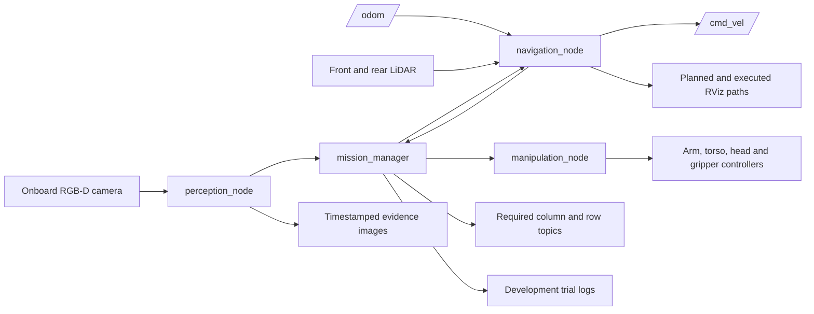

# ERC 2026 Phase 1 - Library Assistant Robot

## Local Gazebo run and current validation

This folder contains the complete simulator and solution. Extra experimental
workspaces are not needed. The restored column-2/red baseline completed in
**5m18s from solution launch**, with zero reported collisions and the whole book
inside the bin.

The `fix/all-books` branch now has complete guarded offline plans for all three
lower shelf rows, alongside selected-bay tracking and multi-face depth fitting.
The plans check robot and gripper entry against the registered shelf, preserve
the bottom book's separate withdrawal route, and stop with the gripper closed
if a lower-row failure leaves the book held. Delivery across all 20 targets and under-five-minute
mission timing remain unverified for this branch. See the
[all-books validation record](docs/all_books_validation.md).

From this folder on the Linux desktop:

```bash
./tools/show_gazebo.sh 4 blue
```

The two arguments select the printed shelf number and book colour. With no
arguments, the launcher uses column 2 and red. Close Gazebo to end the run.
See [GitHub and clean-machine setup](docs/github_quickstart.md) and
[local validation evidence](docs/local_gazebo_demo.md).

For GitHub, publish this folder. Source, models, test fixtures, launch tools and
documentation are included; local builds, generated images and run logs are
ignored. The source retains its original third-party notices and licences.

The historical development records below describe separate runs and machines.


ROS 2 Humble development candidate for the Emirates Robotics Competition 2026 Phase 1 simulation challenge. The package detects numbered shelf markers and the requested book, navigates a TIAGo Pro, attempts a payload-checked left-arm grasp, returns toward the start area, detects the red bin, and attempts placement. Saved development runs are documented below without treating controller success as proof of task success.

| Submission field | Value to complete before recording |
|---|---|
| Team | `TEAM_NAME` |
| University | `UNIVERSITY` |
| ROS package | `erc_phase1_solution` |
| Baseline | Official `erc_sim_2026` main pinned to `b1f9b05e20f4750b59f3321d88f172cc4dbb1386` (9 September update) |
| Status | Candidate69 completed the same headless pickup-and-delivery task twice with strict final containment: approximately 4:52.546 and 4:58.012 including simulator startup. Competition-video compliance remains unverified. See [current performance](docs/current_performance.md). |

> Replace every `TEAM_NAME` and `UNIVERSITY` placeholder before recording or submitting. These are unscored development results, not a competition-ready submission or a success-rate estimate.

## Competition baseline

This workspace now uses the unchanged organizer assets from official [`dfl-rlab/erc_sim_2026` main at `b1f9b05`](https://github.com/dfl-rlab/erc_sim_2026/tree/b1f9b05e20f4750b59f3321d88f172cc4dbb1386). The supplied Phase 1 PDF originally names `v1.0.0`, and the latest numbered release remains `v1.0.3`, but the organizer subsequently [merged the update for teams to continue development](https://github.com/dfl-rlab/erc_sim_2026/issues/2#issuecomment-5582821341) and published the [9 September rules notice for 20 mm books](https://github.com/dfl-rlab/erc_sim_2026/blob/b1f9b05e20f4750b59f3321d88f172cc4dbb1386/README.md). This pinned main commit is the current reference, not a newly named release.

The official update changes the book SDF and checked-in robot URDF: book thickness is 20 mm, book friction is 10.0, fingertip friction is 2.7, and twelve finger hinge effort limits are 40 Nm. The master screw remains limited to 10 N; its command interface remains position-only. The controller plugin, torso, wheels and 0.002 s world timestep are unchanged. No teammate controller or custom physics profile is included. [official_environment.json](official_environment.json) records the exact adopted asset hashes.

Use the organizer's checked-in URDF. Do not regenerate it with the older upstream generator, which does not reproduce the newly published gripper values. The [official-reference guide and integrity checker](tools/official_reference/README.md) provide a reproducible source check. This baseline guidance supersedes older version-freeze notes in the preserved historical checklists. Recheck published organizer updates before final submission and record the exact source/image used.

## Current status — 14 September 2026

This release contains the exact **453-file candidate69 / revision117** package and the configuration used by **Run97 and Run99**. Both completed the same headless seed-101 task, requesting shelf column 2 and a red book, with unchanged official models, controllers and physics. Solution launch to completion took **4:36.906** and **4:43.676**. Including simulator startup, the recorded times were approximately **4:52.546** and **4:58.012**. The startup marker has one-second precision; build time and the extra observation period after completion are excluded.

Both completed trials passed the unchanged strict final-containment check: 22 stable samples over 23.006 and 20.992 simulated seconds. Minimum final side clearance was **66.213 mm** in Run97 and **0.780 mm** in Run99, so landing position still varies. Run98 failed sensor readiness before mission dispatch between these successes; that failure is retained. Other targets, broader reliability, GUI timing and a complete five-minute competition video remain unverified.

The routine ends at the checked stationary release with confirmed target/bin contact. **Final hand return was not performed.** Placement remains a drop, with the last measured book bottom before opening approximately 267 mm and 262 mm above the bin floor. Gentle placement and continuous collision clearance are not established.

The selected profile uses a 0.0182 m stock gripper target, shorter checked arm segments, faster normal-navigation convergence and less repeated head/contact-processing work. The current yaw change passed **534 affected tests and three constructor modes**; earlier affected-module results and the **5,986-test Full63 ancestor** remain separately identified. No new full-suite run is claimed. The normal public launch selects all tested profile values. See [current performance](docs/current_performance.md), [compact evidence](docs/evidence/five_minute/README.md), and [testing instructions](docs/testing.md), which supersede the historical package README's testing instructions. Older status sections below retain their original evidence scope.

## Historical status — 12 September 2026

**Current promoted software is revision57 / final22; Run50 completed and its closed outcome is verified.** All 3,706 software tests passed. Run50 (`547cfa24165d`) delivered the book and completed measured hand HOME at 855.303855428 seconds, then reached **DONE at 855.558420083 observer wall seconds (14 min 15.558 s)**, **44.442 seconds under 15 minutes**. This is one verified run, not a success-rate or full competition-readiness claim. Archived Run50 and its owned processes are closed; this statement does not describe a later GUI demonstration. See the [revision57 record](docs/revision57_validation.md) and its [portable evidence](docs/evidence/revision57/README.md).

Run50 has all eight book corners inside the bin, a +0.775161 micrometre floor residual and **2.537164 mm minimum side clearance**. Twenty-two identical book/bin poses span 20.104 ROS seconds, with the bin unchanged. The six-job audit found no overlap in 208 atomic screen samples, 208 book and 208 available measured-tool screen queries, and 64 table/bin samples. Three measured tool-link poses were unavailable. The book dropped onto the bin floor. An earlier sampled floor residual was -1.477244 mm; the audit excludes book/bin landing contact and does not prove continuous clearance or gentle handling. The pre-open gate passed in 2.729 seconds without using the extra five seconds or accepting an advanced contact generation; success cannot be assigned causally to either change. The earlier [R55 / Run48](docs/revision55_validation.md) and [R56 / Run49](docs/revision56_validation.md) failures remain preserved.

**R54 / final19 remains the verified fallback build**, with 3,431 software tests and the archived Run47 (`43f372da29cd`) delivery in **898.556826535 seconds (14 min 58.557 s)**, whole-book containment, settled floor support and measured arm/torso return. This is one verified under-15-minute trial with only **1.443 seconds of headroom**, not a rollback performed by this documentation update or a success-rate estimate. See the [revision54 record](docs/revision54_validation.md).

Run47's minimum final side clearance is **1.806192 mm**, with 23 identical settled book/bin poses over 20.568 ROS seconds and no bin displacement. The landing still involved a near-half-turn book rotation and a sampled transient floor excursion. No overlap was found in 215 atomic screen samples and 68 eligible table/bin samples; actual-tool/book screen queries omit one PICK pose with 38 ms skew. This evidence does not establish gentle or robust placement, continuous safety, or repeatable under-15-minute performance. The terminal physical report preserves the limits in the local-only archive at `output/official_reference/run47_review/quality_evaluation/terminal_review01.md`. The preceding [Run46 on revision53 / final18](docs/revision53_validation.md) completed in 981.073248649 seconds (16 min 21.073 s); these separate runs do not isolate a causal speedup.

**Revision52 / final17** passed 3,309 tests and introduced immutable tool geometry reuse, optional faster supported arm timing with fresh velocity admission, and the nominal torso-height route retained in revision53. Instrumented Run45 passed pickup and faster compaction but stopped during stationary placement planning at 12 min 35.601 s. Independent contact records show both fingertips touching the book across the abort; the manipulation monitor's exact internal contact timestamps were not recorded. See the [revision52 record](docs/revision52_validation.md). Shelf extraction timing and official physics remain unchanged.

Run44 on revision51 (`bef7db4d5e17`) picked and carried the book, then stopped before placement at **16 min 25.646 s** because the measured-torso admission rejected its state after planning. It did not release or deliver the book. Planning took 240.264 seconds versus Run43's 324.159 seconds, with different live inputs and 2,277 versus 2,335 samples; this is not an identical-workload speed comparison. See the [revision51 record](docs/revision51_validation.md).

**Earlier successful Run43 on revision49:** pickup, delivery and measured arm/torso return took **20 min 41.724 s**. The whole book is inside the bin with 0.725474 mm minimum side clearance and no bin displacement. No overlap was found in 284 screen and 111 eligible table/bin samples, with timestamp, omitted-link and coverage limits. See the [revision49 record](docs/revision49_validation.md).

**Earlier revision47 / final12:** 3,042 full ROS tests passed with no failures, errors or skips, together with selected/default four-node constructors and unchanged official assets. Run42 completed pickup at 7 min 46.018 s, returned to the bin area, then automatically stopped at 12 min 08.409 s when the repeated `look_bin` failed. No PLACE command, opening or delivery occurred; a correction to head-shortcut eligibility handling is pending. See the [revision47 validation record](docs/revision47_validation.md). **Run41 on revision43 reached placement planning after 15 min 55.742 s and was ended for diagnosis while still holding the book.** No placement or release occurred. The [revision43 record](docs/revision43_validation.md) retains its partial run and offline timing evidence; the [revision42 record](docs/revision42_validation.md) retains the completed Run40 delivery.

**Run40 completed pickup, compact transport, release and measured hand return:** 35 identical final book/bin poses span 30.690 ROS seconds and put the whole book inside the audited core, with a +0.758599 micrometre floor residual and unchanged bin pose. Side clearance is only **0.379252 mm**. The only scoped contact pair was intended book/bin contact; no overlap was found in 317 sampled screen states and 129 table/bin states, with timestamp and coverage limits. DONE was **42 min 10.733 s observer wall time** (656.600 ROS). During the stationary planning hold, book-to-hand drift reached **13.771 mm /18.550 degrees**, and actual corners protruded **47.642 mm beyond the logged padded nominal attachment**. Delivery does not validate that envelope, gentle scoring, five-minute timing or repeated-trial reliability. See the [Run40 physical record](docs/revision42_validation.md#completed-run40-physical-result).

**Run39 completed the full physical sequence on the explicit collision-quality profile:** pickup, extraction, compact carry, bin approach, release and empty return. The book settled wholly inside the conservative cavity with the bin unchanged. `DONE` took 40 min 32.731 s observer wall time (516.600 ROS). Its final side clearance was only 0.474768 mm. No overlap was found in 313 sampled visual-screen states or 124 eligible table/bin states, with separately stamped actual-tool evidence and disclosed gaps. Planning-hold drift reached 17.254 mm /20.742 degrees and exceeded the earlier nominal attachment envelope; successful delivery does not remove that limitation. See the [current physical and software record](docs/revision41_validation.md#completed-run39-physical-result). This is neither continuous/general collision proof nor a competition-ready five-minute or repeatability result.

Run33 and the Run34 live GUI demonstration autonomously picked the requested book, carried it back to the required Start/End Zone, found the bin, released the book and completed the arm return. Independent, read-only simulator-pose analysis verified the released book resting flat on the bin floor with its entire footprint inside. Run34's strict zero-tolerance containment flag is false only because the bottom lies 0.207 micrometres below the ideal floor plane; that numerical residual is not relabeled as a strict pass. Those evaluator poses were used only to assess the outcome, never as controller inputs. Both runs used unchanged official `b1f9b05` assets and the same seed 101, column 2, red-book scenario; they are not five randomized trials or a success-rate estimate.

| Development run | Physical outcome | Observer wall time to `DONE` |
|---|---|---|
| Run33 (`8d9270889a54`) | Released book inside the bin; arm/tool contact moved the bin | 23 min 05.962 s |
| Run34 (`7d9725f7b068`, GUI demonstration) | Repeated delivery inside the bin; bin contacts and arm/table collision also observed | 25 min 47.556 s |
| Run39 (`3f9468467cf5`) | Whole-book floor landing and completed return; only intended book/bin pair recorded; sampled checks clear with stated limits | 40 min 32.731 s |
| Run40 (`11f08d9184fb`) | Whole-book floor landing and measured hand return on revision42; only intended book/bin pair recorded; sampled geometry found no overlap with stated limits | 42 min 10.733 s |

Run33/34 were not collision-free, and none of the listed durations meets the five-minute unedited video requirement. Run34's table contact was corroborated by offline intersections of the official arm/table meshes. The bin moved during placement/return, and final containment does not make that route acceptable. Run36 subsequently picked up and carried the book, then the operator cancelled during stationary PLACE planning to correct the bin reference and investigate planning time. No placement motion, release or empty return occurred; its `ABORTED` status is not an autonomous route or deadline failure. Revision38 passed 2,622 full ROS tests and selected/default four-node constructor checks. Run37 then picked up and carried the book but reached its automatic 2700-second trial limit during stationary PLACE planning. No PLACE `ik_ready`, placement motion, opening or return occurred. The book remained held and the bin stayed unmoved; the book shifted relative to the hand during the long hold. See the [completed Run37 record](docs/revision38_validation.md#physical-outcome).

The demonstrated profile uses the ordinary public position command with a sustained `0.017 m` master-joint target, fresh named-book contact monitoring, a 5 mm initial lift and supported carry. The target is an actuator coordinate, not measured pad separation. Its explicit stock-close diagnostic mode bypasses our experimental force/effort-amplitude and pressure-qualification policies; the official controller limits and physics remain unchanged. Fine micro-preload and preclose aperture-interval modes were disabled. These selected options are not the package defaults.

[docs/run34_runtime_profile.json](docs/run34_runtime_profile.json) preserves the historical Run34 settings. The public launcher now accepts `profile:=collision_quality`, with installed node overrides and unchanged ordinary defaults. The required column/colour-only command still uses those defaults; its outcome must not be inferred from selected-profile runs. See the [profile guide](docs/collision_quality_profile.md) for the runnable development command and the [portable validation record](docs/revision38_validation.md) for software and physical evidence. The current profile fits the bin center and orientation from onboard RGB-D, checks table/bin material and the head-screen envelope, waits for measured motion endpoints, and tries a shorter fully checked setup. It also prioritizes completing a candidate route and removes duplicate contact-processing work. The [revision41 record](docs/revision41_validation.md) preserves the planning diagnostics and conservative current-vertex separation check. Run38 passed its complete nominal candidate validation but exceeded the 900-second search allowance before a PLACE command could be sent; no placement motion or release occurred. A separate replay of its exact logged inputs passed in 189.318 seconds with a fixed parked context 156 ms later, and all 178 sampled PICK/COMPACT screen checks found no overlap. Neither result proves continuous clearance or physical delivery. Revision41 passed 2,668 full ROS tests and selected/default constructors with a selected 1800-second planning allowance. Run39 subsequently delivered the book, completed its return and had no sampled screen/table/bin overlap. Five-minute timing, robust attachment and landing margins, and varied reset trials remain unresolved. The later handoff-guard and AABB changes are included in current revision42 software, but Run39 did not execute them. Run40 subsequently delivered on those revision42 bytes; its physical and software evidence remain separate.

All older seed-101 runs, retry-19/25/26 measurements, saved grasp/route certificates, the 10 September diagnostics and the 973-test result below belong to historical `v1.0.3` source/configurations. They remain useful failure and regression evidence; they are not proof for the new 20 mm model. Recompute geometry/certificates and verify live retention before treating them as current evidence.

The official host requirements are Linux x86_64 (Ubuntu 22.04 or 24.04 with X11), Docker Engine with Docker Compose v2, Git, and about 15 GB of free space. An NVIDIA GPU is optional but improves rendering performance. Windows and ARM hosts are not listed as supported competition hosts.

## Quick start

From the repository root on a supported Linux host:

```bash
./docker/up.sh --build
./docker/attach.sh
```

Inside the container:

```bash
cd /opt/erc_ws
colcon build --symlink-install
source install/setup.bash
ros2 launch erc_bringup simulation.launch.py
```

Leave that terminal running. Open another host terminal, attach to the existing container, then source the workspace:

```bash
cd /opt/erc_ws
source install/setup.bash
```

The exact competition solution launch command is:

```bash
ros2 launch erc_phase1_solution solution.launch.py shelf_column_number:=2 book_colour:=red
```

Replace the example column (`1` through `5`) and colour (`red`, `blue`, `green`, or `yellow`) with the assigned values. Development arguments include `team_name:=TEAM_NAME`, `rviz:=true`, `dry_run:=true`, `trial_timeout_seconds:=SECONDS`, and `profile:=collision_quality`. The launcher defaults to the `collision_quality` profile and a `1800.0`-second development watchdog; `profile:=default` explicitly selects the base settings. This watchdog is our software setting, not the five-minute video requirement. Label diagnostic overrides in run evidence and ensure the final configuration reproduces the submitted video under the evaluator's required launch command. The separate video deliverable is limited to five minutes without edits or speed-up.

### Collision-quality development run

After rebuilding and sourcing the package, the tested profile is selected by default. The equivalent explicit development command is:

```bash
ros2 launch erc_phase1_solution solution.launch.py \
  shelf_column_number:=2 book_colour:=red profile:=collision_quality \
  trial_timeout_seconds:=1800 team_name:=TEAM_NAME
```

This selects the fitted-bin placement and collision-quality development profile, including Run76's 0.0181 m stock gripper target. Official physics remain unchanged. See [current performance](docs/current_performance.md) for the current result and the [revision42 validation record](docs/revision42_validation.md) for the preserved Run40 result. Older profile-guide launch defaults describe those historical revisions.

### WSLg graphics for local development

On Windows, run the Docker commands from a WSL 2 Ubuntu terminal with WSLg.
`./docker/up.sh` detects `/dev/dxg` and automatically adds
[`docker/docker-compose.wslg.yml`](docker/docker-compose.wslg.yml). This passes
the Windows graphics driver into the container without changing the robot or
world. The override mounts all of `/usr/lib/wsl`; mounting only its `lib/`
directory omits the vendor driver and can cause CPU rendering.

Run `glxinfo -B` in WSL to check host acceleration. After launching Gazebo,
inspect `~/.gz/rendering/ogre2.log` inside the container: the `GL_RENDERER` line
should name the GPU, such as `D3D12 (AMD Radeon RX 5700 XT)`. `llvmpipe` means
software rendering. The early EGL device list alone does not identify the
renderer actually used. On 2026-09-10, both WSL host acceleration and Gazebo's
`GL_RENDERER` were verified as D3D12 on the AMD Radeon RX 5700 XT. This confirms
hardware rendering; mission performance still needs separate validation.

See Microsoft's [WSLg container instructions](https://github.com/microsoft/wslg/blob/main/samples/container/Containers.md).
WSLg is a development setup; the official competition host requirements above
still apply.

## Architecture



| Node | Responsibility |
|---|---|
| `perception_node` | Uses live onboard RGB-D data to detect numbered shelf markers, coloured books and the red bin; saves annotated evidence images. |
| `navigation_node` | Runs a conservative odometry-frame holonomic waypoint controller and publishes planned/executed paths. |
| `manipulation_node` | Uses URDF-derived inverse kinematics and the left arm to pick and place; commands the public gripper topic. |
| `mission_manager` | Coordinates the bounded search, approach, pick, return and place state machine; publishes required scoring topics and telemetry. |

The implementation intentionally does not claim to use Nav2 or MoveIt. The official container includes those dependencies, but the competition repository does not provide a ready competition map, Nav2 bringup, or configured MoveIt planning stack. Navigation is odometry based and does not provide global obstacle replanning.

## Competition-facing interfaces

| Interface | Type | Use |
|---|---|---|
| `/erc/shelf_column_identification` | `std_msgs/msg/Int32` | Required detected shelf column publication. |
| `/erc/shelf_row_identification` | `std_msgs/msg/Int32` | Required detected shelf row publication. |
| `/cmd_vel` | `geometry_msgs/msg/Twist` | Holonomic base command. |
| `/odom` | `nav_msgs/msg/Odometry` | Base pose feedback. |
| `/scan_front_raw`, `/scan_rear_raw` | `sensor_msgs/msg/LaserScan` | Proximity stop input. |
| `/gripper_left_controller/joint_trajectory` | `trajectory_msgs/msg/JointTrajectory` | Cross-version public left-gripper command topic. |
| `/erc/navigation/planned_path` | `nav_msgs/msg/Path` | Intended path for RViz/report evidence. |
| `/erc/navigation/executed_path` | `nav_msgs/msg/Path` | Actual odometry trace for RViz/report evidence. |

In the current pinned official source, as in `v1.0.3`, the real gripper controllers are named `gripper_left_controller_raw` and `gripper_right_controller_raw`, with clamp proxies preserving the public `.../joint_trajectory` topics. `v1.0.0` does not use those `_raw` controller names. This package publishes only to the stable public left-gripper topic and does not depend on a gripper action server.

## Evidence and results

The perception node creates timestamped PNGs with bounding boxes in the repository-level `erc_images/` directory. The mission manager writes development telemetry and planned/executed path artifacts to repository-level `results/`. Explicit output directories may instead be set with:

```bash
export ERC_ERC_IMAGES_DIR=/opt/erc_ws/erc_images
export ERC_RESULTS_DIR=/opt/erc_ws/results
```

The JSONL and summary files are diagnostic records, not official judging results. With the selected `delivery_evidence_enabled` path, completion requires measured opening, checked arm return and fresh, attempt-correlated accepted book/bin contact. It reports `success_scope=placement_operation_completed` and `delivery_outcome=released_with_bin_contact`; `physical_inside_verified` remains null without independent onboard proof. The default legacy contact gate has a narrower evidence scope. Neither a successful trajectory nor contact alone proves whole-book containment or a collision-free route. Correlate contacts, physical settling and the unedited video for final assessment.

## Historical validation — official v1.0.3

The records in this section predate adoption of official `b1f9b05` and its 20 mm book. Numerical poses, grasp thresholds, route certificates and test counts describe the source version used at the time, not a validated updated-model run.

The 10 September 2026 review reproduced the historical stock-physics failure:
trial `618db2a2da89` identified column 2/red, verified the requested book and
extracted it, then aborted on book-to-robot contact after approximately 82 mm
of its 350 mm base retreat. No delivery was completed. The bin detector repair
was separately verified from a fresh simulator camera view, producing 12
verified detections of the real bin and a timestamped annotated image.

The new `shelf_side_cradle_enabled` development option is **disabled by
default**. Its shallower grasp and supported carrying path pass sampled mesh
checks, but the empty-arm setup at the shelf is blocked by self-collision or
shelf clearance. Its detailed geometry checks also need substantial runtime
optimization. It is not a validated transport fix or a competition profile.
The older retries below describe historical configurations, not the latest
working-tree validation.

Historical review validation: the package built and all **973 ROS-enabled tests
passed** (340.44 s). Fresh diagnostic trial `6f36cc48f1b6` rejected the proposed
setup before executing the pick, recorded zero collision episodes and ended
without acquiring a book. Its 900-second diagnostic timeout is not the normal
submission configuration. Logs, parameter manifests and the live bin evidence
are under `results/hardware_review_2026_09_10/` in this checkout.

Verified in the ROS 2 Humble development container on 2026-08-27 and 2026-08-28:

- The official v1.0.3 simulator, controllers, clamp proxy, camera/depth bridge and contact topics launched successfully.
- The package built with `colcon`, and repeated four-node solution launches completed.
- Final development validation completed with 139 tests passed in 11.59 s, clean Python bytecode compilation, `git diff --check` exit 0 (line-ending warnings only), and one package built by `colcon` in 4.97 s.
- On 2026-09-04, the retry-19 carried-return regression was updated with dependency-free collision checks against the official base, torso, head/camera and both seven-joint arms, including exact nonadjacent-link self-collision and closed-mesh containment checks at endpoints and adaptive interior samples. The parked arm is evaluated from measured joint state rather than its nominal command. It adds a guarded upright compact transport posture, payload-aware bin candidate selection, post-close recovery guards and a straight 0.70 m shelf retreat before turning. The extended lowered pose is permitted only for that fixed-heading clearance retreat, which leaves 0.519 m beyond the configured shelf margin during the audited fold. The selected 10-leg compact fold passed an earlier 601-sample exact triangle-surface audit; the containment-enabled production route also passed all native checks and a 100-sample dense spot audit. It peaks at 42.43 degrees of book tilt and finishes with a base-limited 0.436 m modeled base/torso/head/both-arm-link/payload planar radius (book 0.418 m). Free-joint IK stays at least 0.01 rad inside URDF hard stops, with a 0.03 rad placement margin. Planning rejects the pick before arm motion when the post-retreat compact route is unsafe. Overview row publication requires a complete four-row layout while tolerating split components. The host-only geometry/helper suite passed 118 tests with 2 ROS-dependent modules skipped; these changes have not yet been exercised in Gazebo.
- A genuine RViz view was captured from the transient-local planned/executed path topics.

The production safety gates at that historical checkpoint ignored parked right-gripper contacts in the left-arm pinch verifier, never closed further after an undersized pinch, used a 0.018 m hold with a 0.016 m operational floor, and recovered a failed pick motion only through prechecked segments. A failed placement motion stopped with the payload retained rather than releasing at an unknown pose. If a required recovery was unsafe or failed, the mission aborted. Current 20 mm defaults are documented above and in `config/solution.yaml`.

Saved simulator evidence remains diagnostic. Retry 9 (`704e2a55e21a`) returned with invalid cargo and logged eight unexpected-contact episodes. Retry 10 (`9133c7a3da61`) rejected an empty closure. Retry 11 (`c40fb46075ec`) was intentionally stopped during search. Retry 12 (`f126f75ea357`) correctly rejected a live payload sweep before arm motion and logged zero collision episodes. Retry 15 (`f2e020010e12`) reached both shelf goals, then made two failed pick attempts, logged three shelf-contact episodes, and aborted during the next reacquisition with `book_reacquisition_failed`.

Retry 16 (`f59b1e43ab8f`) correctly identified column 2 and the red book in row 1. It reached both shelf goals with no logged collision episode, but bilateral red-book contact at closure still produced a near-zero 0.000004632 m primary finger position, so the verifier rejected the grasp. The run was intentionally interrupted after that first attempt to avoid identical retries. Its subsequent guarded-preclose change was live-tested in retry 17; retry 16 itself did not validate it.

Retry 17 (`85b3813da159`) live-confirmed the guarded preclose gate at 0.020012605 m, but carried motion then produced book-to-left-arm-link-5 and book-to-base contacts before `execution_failed`. It timed out entering a retry; no retained grasp or mission success was established.

Retry 18 (`e2ba29e074ef`) live-confirmed the 0.018 m hold and safe contact-loss recovery, but retention was lost during fixed-orientation lowering. The second visual reacquisition failed; no retained grasp or mission success was established.

Retry 19 (`2172a3aa1379`) is the terminal development diagnostic. It correctly identified column 2 and the red book in row 1, then reached the shelf observation pose (1.444066 m planned, 1.407512 m executed, ratio 0.974687, 10.750 sim s, 44.561 mm end error) and book-grasp standoff (0.770540 m planned, 0.730692 m executed, ratio 0.948286, 9.150 sim s and 44.507 mm end error). IK selected loaded-clearance candidate 1 with 5 extraction, 3 lowering and 2 HOME waypoints. The hold was verified bilaterally at 0.018000433 m, and retention survived all 5 extraction plus 3 lowering legs. On the first home-transition leg (leg 8), the red book contacted `arm_left_5` at ROS 93.552 s; retention monitoring reported `grasp_lost` at ROS 95.714 s. Safe carried recovery opened the gripper and succeeded, but the following visual reacquisition failed. That run used a planner without carried-book-versus-robot-volume checks. The current code rejects that HOME sweep, keeps the collision-checked lowered pose only while backing 0.70 m straight off the shelf, then requires a radius- and tilt-gated compact fold before the first turn. It preserves the grasp-specific lowered pose as a checked bridge into a payload-filtered bin approach. These changes still require a live same-seed Gazebo run. Retry 19 itself remains `success=false` with `book_reacquisition_failed` after 551.510 wall s, four navigation goals, one pick attempt and one collision episode. There was no retained verified grasp, return, bin detection, placement or mission success. All listed retries use the same seed 101, column 2 and red request; this package is not competition-ready, and none of these retries substitutes for the five reset randomized official trials.

Retry 25 (`7c530c85f052`) established the first repeatable exact-target top-row pressure grasp.  It acquired at 0.030009 m, applied a 0.029009 m transport lock, measured 2.44 N / 4.04 N fresh bilateral fingertip force, retained the book through all five slow extraction legs, and passed the final settle/contact probe.  It then lost the book after roughly 56-60 mm of the 0.35 m carried shelf retreat. Retry 26 (`12db82e07f93`) tested an 18 mm clearance-target lift, yielding about 9.6 mm of actual endpoint rise.  It again passed exact-target acquisition, bilateral pressure (2.45 N / 3.36 N), all five retained extraction legs, and the unsupported settle/contact probe, but lost the book after only 25-27 mm of base retreat; Gazebo's final pose placed it on the floor at `z=0.015 m`.  Both attempts ended `success=false` with `payload_hazard:contact_lost` and zero counted collision episodes at termination.  A simple vertical pinch, preload change, or shelf-lip lift is therefore not yet a robust transport grasp; the next production boundary is a guarded rigid-palm/lower-jaw support transfer before any base motion.

Still required on the pinned current official source: verify source integrity, clean-build and live-test the updated grasp/staging/transport configuration, confirm the attached payload stays inside the effective navigation clearance, run five reset randomized final trials, verify exact-book identity and raw contacts against video, and produce the final unedited video and report. Earlier certificates must be recomputed for the updated book and robot assets.

Historical collision-model boundary: the retry-19 generic guard covered the official base, torso, head/camera and arm links 1-7, with a separate palm-mesh audit. The subsequent working-tree review added gripper/tool checks; neither the older certificates nor those code changes establish successful motion on the newly adopted official model.

Run the complete package test suite in the ROS container with:

```bash
cd /opt/erc_ws
source /opt/ros/humble/setup.bash
source install/setup.bash
python3 -m pytest src/erc_phase1_solution/test -q
```

## Repository map

```text
src/erc_phase1_solution/
  assets/digits/            Reference digit templates
  config/solution.yaml      Mission and controller parameters
  config/solution.rviz      RViz evidence view
  erc_phase1_solution/      ROS 2 nodes and vision/kinematics helpers
  launch/solution.launch.py Competition launch file
  scripts/                  Trial-log summary helper
  test/                     Vision, kinematics, runtime, logging, launch, shutdown and state-machine tests
docs/
  PHASE_1_SUBMISSION_CHECKLIST.md
tools/official_reference/
  README.md                 Pinned official-source verification procedure
  compliance_reference.md   Organizer authority and exact update scope
  check_official_integrity.py Read-only source checker
  official_b1f9b05_source_manifest.json Official Git blob identities
official_environment.json    Adopted official commit and asset hashes
```

See the [package README](src/erc_phase1_solution/README.md) for technical interfaces and the [submission and recording checklist](docs/PHASE_1_SUBMISSION_CHECKLIST.md) before any official run.

## License and attribution

The solution package declares Apache-2.0. Vendored simulator dependencies retain their own licenses. TIAGo Pro and its associated descriptions are provided by their respective owners through the official competition repository.
