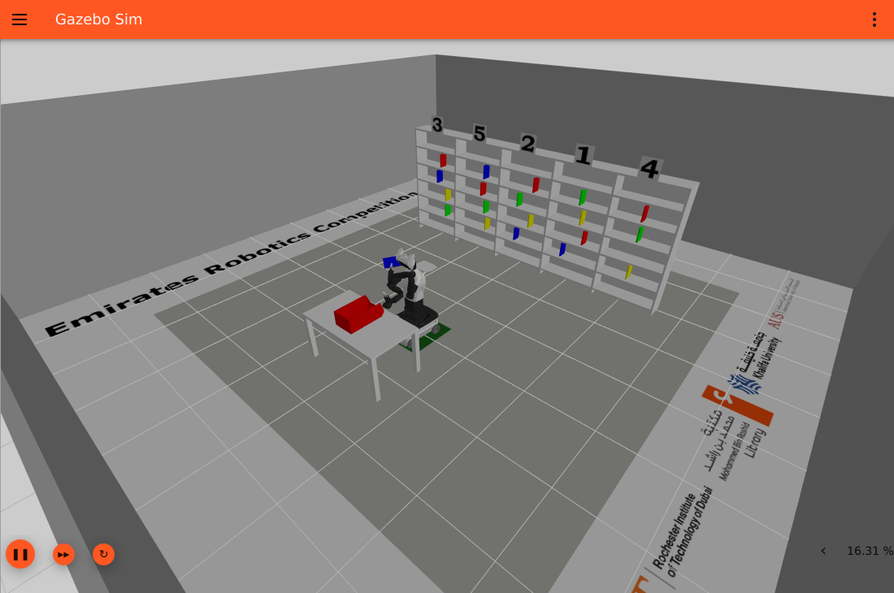

# Column 4 / blue: placement planned, handoff stopped

Visible Gazebo trial `105d91426ddd`, seed 101, frozen source `0a5fa41`, 15 September 2026. The robot acquired the correct book, lifted and withdrew it, compacted its arm, and returned with retention verified. **The registered PLACE plan passed. Execution then stopped with `transition_stop_deadline` at the handoff after arm setup leg 0 and before leg 1, before the bin approach. No opening, release, or delivery occurred.**

The [run review](run_review.json) records **zero collision episodes**, unchanged trial sources, and successful cleanup of all owned process groups. Recorded zero collisions is not a certificate covering unobserved contacts.

## Timing and exact milestones

Solution process launch to terminal summary: **503.281 s**. Simulator launch to terminal summary: **513.500 s**. Mission initialization to summary: 500.465 s. These are live wall times; independent evaluation and process cleanup are excluded. The mission did not meet five minutes.

The following timestamps are ROS simulation seconds. Exact UTC timestamps and payloads are retained in [journal milestones](selected_journal_events.jsonl) and [placement planning events](place_planning_events.jsonl).

| ROS time | Recorded result |
| --- | --- |
| 36.200 | PICK begins for printed column 4 / detected row 3. |
| 75.994–76.176 | `book_col_5_row_4_blue` latched; bilateral contact confirmed at master position 0.0182116 m. |
| 91.040 | Settled bilateral grip verified; PICK succeeds. |
| 100.866 | Compact transport completes, with retention verified. |
| 113.100–113.300 | PLACE begins; post-navigation retention and perception input handoff pass. |
| 113.320 | Actual held-book envelope, carry/staging joints, torso target, registered scenes, measured aperture, and admission context recorded. |
| 119.664–119.738 | Complete PLACE candidate and static open-hand endpoint pass; selected target and `ik_ready` published. |
| 119.938 | Fresh pre-motion bilateral retention passes. |
| 122.350 | Retention passes after raising the torso to the planned 0.35 m height. |
| 123.054 | Handoff reports `transition_stop_deadline`, `after_leg=0`, `before_leg=1`. |
| 123.068–123.100 | PLACE fails; mission aborts, with cancellation and gripper hold. |

The handoff diagnostic records a 500,000,000 ns ROS interval and 2.916 s wall interval. Its joint/odometry stationary-start fields are null and `book_stationarity_verified` is false. These fields identify the failed admission; they do not establish a dropped book. The [mission summary](trial_105d91426ddd_summary.json) contains no measured opening, detachment, release pose, bin contact, or validated delivery.

## Accepted placement geometry

The planner computed a **55 mm** shift along the registered cavity's long axis toward the robot. This was proposal index 3, following the centered and smaller-shift proposals. The original and selected minimum horizontal wall reserves were both **35.8351 mm**, using all eight padded book corners and the unchanged **14.1649 mm** combined material/registration margin.

The accepted plan reports **34 IK calls**, one complete candidate, **2,583 scene samples**, 21 setup legs and 19 Cartesian waypoints. Planning diagnostics report 54.671 s wall time, including 50.504 s for the Cartesian search. The accepted static open-hand endpoint is a modeled geometry check; the gripper did not physically open during this trial.

[Recorded plan](recorded_place_plan.json) retains the selected Cartesian poses, registered bin/table geometry, search diagnostics, setup policy/counts, modeled margins and release target. **Accepted joint waypoint arrays were not journaled.** This archive does not invent those routes or claim that the complete planned arm motion executed.

## Recorded inputs and replay limits

[Recorded PLACE inputs](recorded_place_inputs.json) contains the exact `scene_construction_begin` payload values, omitting only its CPU telemetry. The complete original event remains in `place_planning_events.jsonl`. Inputs include:

- Measured carry state, retained staging seed and planned torso-ready state.
- The retained eight-corner attachment, measured gripper master value and producer stamp.
- Original centered Cartesian route and tool rotation.
- Selected bin and table scenes, their model hashes and engineering margins.
- Selected admission reference, including measured parked right/head joints and odometry metadata.

Both complete selected scenes uniquely match the [recorded perception observation](selected_scene_observation.jsonl) stamped **113.158 s**, received at 113.238 s. This identifies the selected scene directly; the earlier trial's inferred 115.500 s inputs are not used here. The admitted bin CAD floor center is `[0.938346877, 0.012856265, 0.751103398]` m in `base_footprint`.

The exact joint trajectory result and every later per-sample parked-joint reading are absent. Recomputing a nominal plan from the recorded inputs is possible, but exact execution/controller scheduling and physical release are not established by this archive. No observer world pose was used as controller input or added as a substitute measurement.

## Viewer evidence and provenance

All four images were visually inspected and show the correct Gazebo viewer: [startup](startup.png), [after lift](after_lift.png), [post-retreat compaction](post_retreat_compacted.png), and [terminal hold](terminal.png). They are unmodified contextual screenshots, not synchronized pose measurements. Images from `/tmp/erc_registered_place_milestones` used stale window dimensions and are excluded.

[Provenance](provenance.json) records source and original-log hashes, screenshot hashes, exact event counts, the selected-scene match and original ignored run path. [Source hashes](source_hashes.json) preserves relevant runtime/configuration/model identities from this trial. The manifest's content digest and the serialized manifest-file SHA-256 are separate values.

Assembly used only file reads, exact event-line selection, JSON field extraction, hashes and unmodified image copies. No simulation, ROS observer, solver, mesh calculation, runtime edit or commit was performed for this archive.
