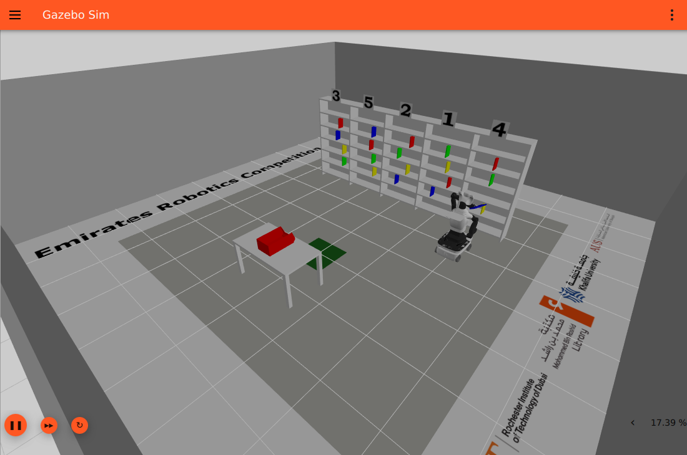

# Column 4 / blue: retained transport, placement planning stopped

Visible local Gazebo trial `dd540101cd5e`, seed 101, 15 September 2026, frozen source `d19e4f0`. The robot acquired the correct blue book with both fingers, lifted and withdrew it, compacted the arm, and returned to the bin with retention verified. **PLACE failed with `scene_cartesian_ik_budget` before release. No delivery or sub-five-minute completion was demonstrated.**

The journal recorded **zero collision episodes**. This describes the recorded run, not a certificate covering unobserved contacts. [Run review](run_review.json) confirms unchanged trial sources and that all owned process groups stopped.

## Timing and milestones

Wall time to the terminal mission summary was **511.505 s from solution process launch** and **521.828 s from simulator launch**. Mission initialization to summary was 508.616 s. Evaluation and process cleanup are excluded from those durations. These are live wall times, not the earlier offline planning benchmark times.

Times in the table are ROS simulation seconds; UTC timestamps and full payloads are retained in [selected exact journal events](selected_journal_events.jsonl).

| ROS time | Recorded event |
| --- | --- |
| 36.300 | PICK begins for printed column 4 / detected row 3. |
| 65.782 | Complete lower-row candidate accepted with registered shelf bounds. These sampled geometric checks are not a physical certificate. |
| 78.172–78.420 | `book_col_5_row_4_blue` latched; bilateral closure accepted at gripper master position 0.0182116 m. |
| 79.050–80.462 | Prospective lift geometry rechecked with measured aperture, lift dispatched, retention verified after initial lift. |
| 93.282 | Settled bilateral retention verified; PICK succeeds. |
| 98.200–103.066 | Post-retreat compaction executes; final retention verified. Reported modeled planar radius 0.436205 m. |
| 111.350 | Return navigation reaches its goal. |
| 115.400–115.602 | PLACE begins; post-navigation bilateral retention verified and input handoff acknowledged. |
| 127.248–127.300 | PLACE reports `scene_cartesian_ik_budget`; mission aborts and publishes a gripper hold. |

No release, detachment, bin contact, or validated delivery is recorded in the [mission summary](trial_dd540101cd5e_summary.json). The failed PLACE command reports 73.367 s of wall time and 38.738 s of command-thread CPU time; its complete failed solver diagnostics were not retained by this journal configuration.

## Viewer evidence

[Startup](startup.png), [extraction](extraction.png), and [post-retreat compaction](post_retreat_compacted.png) are unmodified screenshots of the correct Gazebo viewer. Their milestone filenames provide context; they are not synchronized pose measurements. The earlier screenshots from `/tmp/erc_blue_parallel_milestones` captured the wrong window and are excluded.

## Available PLACE replay inputs

[Recorded bin scenes](recorded_bin_scenes.jsonl) preserves all eight complete `bin_verified` payloads and the idle acknowledgement. Each scene includes the bin CAD pose, cavity/outer bounds, registered floor center, table solids and pose, mesh hashes, engineering margins, and the observation-time odometry reference.

The **115.500 s** observation is the last scene received by the independent recorder before `place_input_ready` at 115.602 s. It is a useful replay candidate; separate subscriber ordering prevents identifying it as the actual selected scene. For that candidate, in `base_footprint`:

- Raw navigation/reacquisition point: `[0.830896855, -0.010144135, 0.751785514]` m.
- Registered CAD floor center used by the PLACE admission path: `[0.936101029, 0.015149248, 0.751101920]` m.

Frozen `match_registered_scenes` checks the observation epoch, measured-context freshness, and base drift of at most 2 mm / 0.005 rad, then returns the recorded scene unchanged. It does not numerically reproject the scene. The exact selected observation and retained measured context at PLACE were not logged.

[Candidate input bundle](placement_candidate_inputs.json) collects that exact scene record, complete recorded approach/lift plans, the earlier measured empty/lift geometry contexts, the nominal positive-wrist compact endpoint from frozen source, and the post-navigation retention event. **The compact endpoint is a source proposal, not measured PLACE joint feedback.** The attachment corners, achieved PLACE joint state, parked-joint context, and full failed solver inputs are missing; a reconstructed replay must disclose those assumptions. [Replay inventory](placement_replay_inventory.json) lists the available and missing inputs. No observer model pose or controller ground truth was used to assemble this archive.

## Provenance and scope

[Provenance](provenance.json) records original log and screenshot hashes, the full frozen commit, and the original ignored run path. [Source hashes](source_hashes.json) preserves relevant runtime/configuration/model hashes from the trial manifest. The manifest's recorded content digest and the SHA-256 of the serialized manifest file are separate fields with different values.

The JSONL subsets preserve exact original event lines. This archive was assembled by reading, selecting, hashing, and copying files; no simulation, solver, mesh computation, or runtime change was performed for it. Large process logs and the complete manifest remain in the local ignored `results/` directory.
